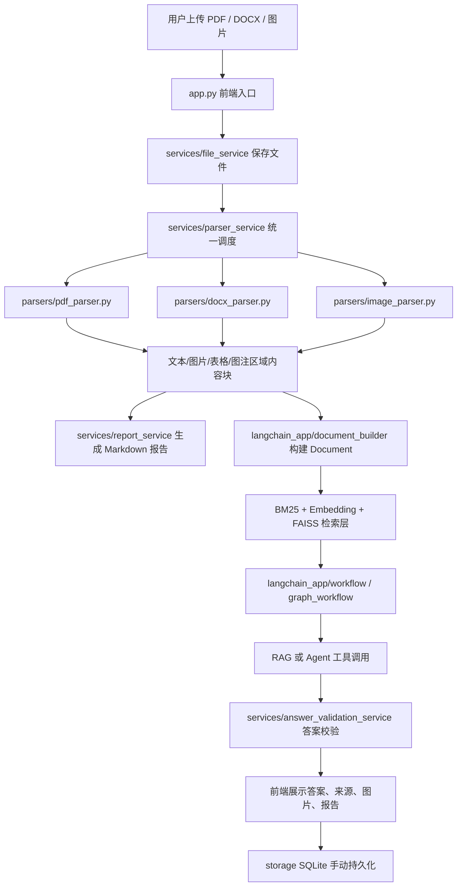

# 多模态图文智能分析助手完整技术说明文档

## 1. 项目背景

在论文、产品说明书、方案文档、课程资料等真实场景中，文档往往不是纯文本，而是由正文、图片、图表、截图、流程图、表格等多种信息混合组成。传统文档分析系统通常存在以下问题：

1. 只重视正文文本，对图片、图表、截图中的信息利用不足。
2. PDF 解析不稳定，容易出现乱码、漏图、漏表、双栏混排错位等问题。
3. 大模型直接问答容易产生幻觉，缺少来源依据和可追溯性。
4. 文档分析结果往往是一次性的，缺少历史会话与状态管理能力。

为了解决上述问题，本项目实现了一个本地轻量、云端大模型驱动的多模态图文智能分析助手。系统支持 PDF、Word、图片上传，能够完成图文内容解析、结构化总结报告生成，以及基于文档证据的问答交互。

---

## 2. 项目目标与范围

### 2.1 项目目标

本项目的核心目标包括：

1. 支持多种文档格式上传，包括 PDF、DOCX、JPG、PNG。
2. 自动提取正文、嵌入图片、图注区域、表格和 OCR 文本。
3. 使用 Qwen 系列模型进行文本总结和图像理解。
4. 生成结构化 Markdown 总结报告。
5. 基于 RAG、Agent 和 LangGraph 实现带来源的智能问答。
6. 提供轻量级历史会话持久化能力。

### 2.2 项目范围

当前版本明确支持：

1. 单轮文档问答。
2. 多模态内容解析与统一索引。
3. 手动保存历史会话。
4. 本地轻量部署与云端模型调用。

当前版本暂不重点覆盖：

1. 企业级多用户权限体系。
2. 分布式任务队列与高并发调度。
3. 复杂表格结构建模与单元格关系恢复。
4. 长周期用户画像式记忆。
5. 完整标准化远程 MCP 平台部署。

---

## 3. 系统总体介绍

### 3.1 系统一句话说明

本系统是一个基于 Qwen 多模态模型、OCR、LangChain、RAG、Agent、LangGraph 和 MCP 兼容工具层构建的多模态文档智能分析助手，能够对图文混合文档进行解析、总结和问答。

### 3.2 核心功能

系统当前具备以下核心功能：

1. 多格式文件上传与解析。
2. PDF / DOCX / 图片中的文本、图片、表格抽取。
3. 本地 OCR 与云端视觉模型联合图像理解。
4. Markdown 结构化总结报告生成。
5. 基于 Embedding + FAISS + BM25 的混合检索问答。
6. 基于工具调用的 Agent 问答增强。
7. 基于 LangGraph 的问答流程编排与失败回退。
8. 基于 SQLite 的历史会话保存与加载。

### 3.3 用户使用流程

用户视角下的基本流程如下：

1. 上传 PDF、Word 或图片。
2. 系统解析文档，提取文本、图片、图表、表格等内容。
3. 对图片执行 OCR 与 Qwen-VL 视觉分析。
4. 系统生成结构化 Markdown 总结报告。
5. 用户围绕文档继续提问。
6. 系统基于检索结果或工具调用回答问题，并显示来源。
7. 用户可手动保存当前会话为历史记录。

### 3.4 总体架构



---

## 4. 系统核心流程

## 4.1 文档上传与解析流程

文档上传与解析是系统的第一条主干流程，其目标是把不同格式的原始文件转成统一的结构化内容块。

流程如下：

1. 前端 `app.py` 接收上传文件，并校验数量与大小。
2. `services/file_service.py` 将文件写入本地临时目录。
3. `services/parser_service.py` 根据文件后缀分发给不同解析器。
4. PDF 文件交由 `parsers/pdf_parser.py` 处理。
5. DOCX 文件交由 `parsers/docx_parser.py` 处理。
6. 图片文件交由 `parsers/image_parser.py` 处理。
7. 所有解析结果统一组织为 `parsed_documents` 数据结构。

该流程的设计重点是：先做结构化内容抽取，再做下游 RAG 和报告生成，而不是把整份文件直接丢给大模型。

## 4.2 总结报告生成流程

报告生成流程的目标是将解析得到的图文内容整理成一份结构统一的 Markdown 文档。

流程如下：

1. `services/report_service.py` 收集解析后的文本块、图片块和表格块。
2. 对图片块保留描述、OCR 文本、来源和本地图片路径。
3. 对表格块保留 Markdown 表格文本，并构造预览内容。
4. 将上述内容组织为总结提示词上下文。
5. 调用 `services/llm_service.py` 使用 Qwen 文本模型生成固定结构报告。
6. 将生成结果保存到 `output/reports/` 并返回前端展示。

报告默认包含：

1. 核心摘要
2. 关键信息提取
3. 图表/图片说明
4. 表格内容摘要
5. 待确认或疑问点

## 4.3 问答交互流程

问答交互是本系统最重要的智能能力之一，目标是根据当前文档内容回答用户问题，并尽量提供可验证来源。

流程如下：

1. 用户输入问题。
2. `langchain_app/router.py` 对问题进行规则路由，判断优先走 RAG 还是 Agent。
3. `langchain_app/workflow.py` 优先调度 LangGraph 工作流。
4. `langchain_app/graph_workflow.py` 根据路由结果执行：
   1. 先走 RAG
   2. 或先走 Agent
   3. 若失败则执行回退
5. `services/qa_service.py` 接收工作流结果并格式化输出。
6. `services/answer_validation_service.py` 评估答案可信度与证据充分性。
7. 前端展示回答、路由说明、校验结论和来源。

## 4.4 历史会话保存与加载流程

系统目前采用手动保存历史会话，而不是自动持久化。

流程如下：

1. 用户完成解析或问答后点击“保存到历史会话”。
2. `services/state_service.py` 调用 `storage/repositories.py` 保存会话。
3. 记录写入 `output/system_state.db`。
4. 后续用户可在侧边栏查看并加载历史会话。

这样设计的原因是：

1. 避免测试数据污染历史记录。
2. 保持轻量状态管理。
3. 明确“当前临时会话”和“正式归档会话”的区别。

---

## 5. 核心模块设计

## 5.1 前端模块

关键文件：

- `app.py`

模块职责：

1. 提供 Streamlit Web 界面。
2. 接收文件上传。
3. 展示 Markdown 报告、图片、表格与问答结果。
4. 管理前端短期状态。
5. 提供历史会话加载入口。

关键实现：

1. 使用 `st.session_state` 保存当前临时上下文。
2. 使用本地图片渲染辅助逻辑解决 Markdown 本地图片不稳定显示问题。
3. 支持手动保存当前会话。

## 5.2 文件解析模块

关键文件：

- `services/parser_service.py`
- `parsers/pdf_parser.py`
- `parsers/docx_parser.py`
- `parsers/image_parser.py`

模块职责：

1. 对不同文件类型执行差异化解析。
2. 将解析结果统一为标准内容块。

### 5.2.1 PDF 解析模块

PDF 解析是项目最复杂的部分，当前能力包括：

1. 使用 `pypdf` 提取页面文本。
2. 使用 `pdfplumber` 作为文本 fallback 与表格提取通道。
3. 使用 `PyMuPDF` 获取版面文本块、页面截图和图注区域裁切。
4. 使用图片抽取 + 图注裁切两种策略提取图像信息。
5. 过滤低质量噪声图片。
6. 对文本块增加 `layout_bbox` 位置信息。
7. 对图像块增加 `caption_text / caption_bbox / matched_caption_index` 等图注绑定元数据。

### 5.2.2 DOCX 解析模块

DOCX 模块主要负责：

1. 提取段落文本。
2. 抽取文档中嵌入图片。
3. 调用图像分析链路补充图片描述。

### 5.2.3 图片解析模块

图片模块主要负责：

1. 读取图片尺寸和格式。
2. 调用 OCR 提取图片文字。
3. 调用视觉模型生成图片描述。
4. 输出带 `ocr_text` 和 `description` 的图片块。

## 5.3 OCR 与图像理解模块

关键文件：

- `services/ocr_service.py`
- `services/llm_service.py`
- `parsers/image_parser.py`

模块职责：

1. 对图片中的文字进行本地 OCR。
2. 对图片、图表、流程图进行视觉语义理解。

关键实现：

1. OCR 优先使用本地能力，失败时返回空文本而不阻断全流程。
2. 视觉理解使用 Qwen-VL 模型。
3. OCR 结果与视觉描述会同时进入图片块。

这样设计的原因是：

1. OCR 擅长读字。
2. MLLM 擅长理解图像语义。
3. 二者结合比单独使用任一能力更适合图文混合文档。

## 5.4 报告生成模块

关键文件：

- `services/report_service.py`
- `services/llm_service.py`

模块职责：

1. 将结构化内容块整理成统一报告上下文。
2. 调用大模型生成总结报告。
3. 组织图片说明、表格摘要与来源信息。

关键设计点：

1. 报告输出为 Markdown，便于预览、下载和二次编辑。
2. 表格内容会同时保留文本表达和可视预览。
3. 本地图片路径在前端做额外渲染，以提升显示稳定性。

## 5.5 RAG 检索模块

关键文件：

- `langchain_app/document_builder.py`
- `langchain_app/embeddings.py`
- `langchain_app/vectorstore.py`
- `langchain_app/retrievers.py`
- `langchain_app/chains.py`

模块职责：

1. 将解析内容块转换成 LangChain `Document`。
2. 建立向量检索和关键词检索能力。
3. 为问答提供来源证据。

当前实现采用混合检索：

1. BM25 用于关键词精确召回。
2. Embedding + FAISS 用于语义召回。
3. EnsembleRetriever 结合两者结果。

设计原因：

1. 纯关键词检索对换一种说法的问题不够稳。
2. 纯向量检索对精确词命中有时不够敏感。
3. 混合召回更适合中文文档问答场景。

## 5.6 Agent 模块

关键文件：

- `langchain_app/tools.py`
- `langchain_app/agent.py`

模块职责：

1. 将 OCR、图片分析、报告摘要、文档检索封装为工具。
2. 允许模型根据问题类型调用工具。
3. 对复杂图片/OCR 问题提供增强能力。

当前工具包括：

1. `search_document_blocks`
2. `run_image_ocr`
3. `analyze_image`
4. `get_report_summary`

当前 Agent 架构不是完全自由式智能体，而是：

1. Tool-calling Agent
2. 带问题路由
3. 带 LangGraph 工作流
4. 带失败回退

这样设计的原因是：

1. 保留 Agent 的灵活性。
2. 避免所有问题都走高成本、不稳定的工具链路。
3. 保证系统在展示和真实使用中更稳。

## 5.7 LangGraph 工作流模块

关键文件：

- `langchain_app/graph_workflow.py`
- `langchain_app/workflow.py`

模块职责：

1. 管理 RAG 与 Agent 的执行顺序。
2. 根据问题类型进行工作流调度。
3. 实现失败回退机制。

工作流状态包含：

1. `question`
2. `parsed_documents`
3. `session_id`
4. `route`
5. `result`
6. `tried_rag`
7. `tried_agent`

LangGraph 当前体现的是“受控图式工作流”，而不是纯线性链路。

## 5.8 MCP 工具接口模块

关键文件：

- `mcp_server/main.py`
- `mcp_server/server.py`
- `mcp_server/tools.py`
- `mcp_server/resources.py`
- `langchain_app/mcp_client.py`

模块职责：

1. 将工具和资源用统一方式暴露给 Agent。
2. 通过本地 stdio 子进程实现 MCP 风格通信。

当前运行方式：

1. `StdioMCPClient` 启动 `python -m mcp_server.main`
2. 客户端通过标准输入输出发送 JSON 请求
3. 服务端统一分发工具与资源调用

工具返回结构统一为：

```python
{
  "ok": True,
  "data": ...,
  "error": None,
  "metadata": {...}
}
```

这样设计的意义在于：

1. 降低 Agent 与业务函数的耦合。
2. 提高工具调用的一致性。
3. 为后续标准化扩展打基础。

## 5.9 状态管理模块

关键文件：

- `services/state_service.py`
- `storage/db.py`
- `storage/repositories.py`

模块职责：

1. 保存历史会话。
2. 保存内容块、报告和问答记录。
3. 加载历史分析结果。

当前状态管理分为两层：

1. 短期记忆：`st.session_state`
2. 长期记忆：SQLite 数据库

数据库中保存的主要表包括：

1. `analysis_session`
2. `document_record`
3. `document_block`
4. `report_record`
5. `qa_record`
6. `agent_run`

---

## 6. 技术选型说明

| 技术 | 用途 | 选型原因 |
| --- | --- | --- |
| Python | 后端与 AI 主开发语言 | 生态成熟，便于 OCR、RAG、Agent 集成 |
| Streamlit | Web 前端原型 | 轻量、上手快、适合展示与实验 |
| Qwen / Qwen-VL | 文本总结与图像理解 | 中文能力强，适合图文分析 |
| OCR | 图片文字识别 | 弥补 PDF/图片中文本提取不足 |
| pypdf | PDF 基础文本与图片读取 | 轻量，适合作为主文本提取通道之一 |
| pdfplumber | PDF fallback 文本与表格提取 | 对表格与部分版面文本更友好 |
| PyMuPDF | 版面文本块、截图、裁切 | 适合做图注区域裁切与版面坐标提取 |
| LangChain | RAG、Document、Tool 抽象 | 便于快速组织检索与 Agent |
| LangGraph | 工作流编排 | 适合管理 RAG/Agent 分支与回退 |
| FAISS | 向量检索 | 本地轻量，性能好 |
| BM25 | 关键词检索 | 对参数、指标、专有名词召回更稳 |
| SQLite | 轻量持久化 | 无需额外部署，适合 MVP |
| MCP 兼容层 | 工具标准化调用 | 降低模块耦合，便于扩展 |

---

## 7. 数据结构设计

## 7.1 解析结果 `parsed_documents`

```python
[
  {
    "file_name": "demo.pdf",
    "file_type": "pdf",
    "blocks": [...]
  }
]
```

## 7.2 基础内容块结构

文本块示例：

```python
{
  "type": "text",
  "page": 2,
  "content": "Word2vec 包含 CBOW 和 Skip-gram 两种核心模型",
  "source": "demo.pdf 第 2 页 文本块 3",
  "text_block_index": 3,
  "layout_bbox": {"x0": 62.5, "y0": 210.4, "x1": 278.2, "y1": 248.9},
  "is_caption": False
}
```

图片块示例：

```python
{
  "type": "image",
  "page": 2,
  "image_index": 1,
  "image_path": "D:/AgentProject/output/...",
  "ocr_text": "图1 神经语言模型",
  "description": "这是一张神经语言模型结构图",
  "content": "图片文件，尺寸约为 ... OCR文本：图1 神经语言模型",
  "source": "demo.pdf 第 2 页 图片 1",
  "caption_text": "图1 神经语言模型",
  "caption_bbox": {"x0": 80.0, "y0": 512.0, "x1": 198.0, "y1": 529.0},
  "matched_caption_index": 1,
  "caption_match_method": "page_order"
}
```

表格块示例：

```python
{
  "type": "table",
  "page": 3,
  "table_index": 1,
  "content": "| 模型 | CBOW | Skip-gram | ...",
  "source": "demo.pdf 第 3 页 表格 1"
}
```

## 7.3 LangChain Document 元数据

`langchain_app/document_builder.py` 会把块转换为 LangChain `Document`，当前重要 metadata 包括：

1. `file_name`
2. `file_type`
3. `block_type`
4. `source`
5. `page`
6. `image_index`
7. `table_index`
8. `image_path`
9. `ocr_text`
10. `description`
11. `layout_bbox`
12. `caption_text`
13. `caption_bbox`
14. `matched_caption_index`
15. `caption_match_method`
16. `crop_bbox`

## 7.4 MCP 工具响应结构

```python
{
  "ok": True,
  "data": {...},
  "error": None,
  "metadata": {...}
}
```

## 7.5 问答输出结构

问答结果会包含：

1. 路由说明
2. 最终回答
3. 答案校验结果
4. 检索来源或工具调用轨迹

---

## 8. 关键代码文件说明

| 文件 | 作用 |
| --- | --- |
| `app.py` | 前端入口、文件上传、问答交互、报告展示 |
| `services/file_service.py` | 文件保存与目录管理 |
| `services/parser_service.py` | 统一文件解析调度 |
| `parsers/pdf_parser.py` | PDF 文本、图片、图注、表格解析 |
| `parsers/docx_parser.py` | DOCX 段落和嵌入图片解析 |
| `parsers/image_parser.py` | 图片 OCR 与视觉理解 |
| `services/report_service.py` | Markdown 报告生成 |
| `services/qa_service.py` | 问答服务总入口与输出整理 |
| `services/answer_validation_service.py` | 问答可信度与证据检查 |
| `langchain_app/document_builder.py` | 块到 LangChain Document 的转换 |
| `langchain_app/retrievers.py` | BM25 + FAISS 混合检索 |
| `langchain_app/chains.py` | LangChain RAG 链 |
| `langchain_app/agent.py` | Tool-calling Agent 与 fallback |
| `langchain_app/router.py` | 问题路由器 |
| `langchain_app/graph_workflow.py` | LangGraph 工作流 |
| `langchain_app/mcp_client.py` | MCP stdio 客户端 |
| `mcp_server/server.py` | 本地 MCP 服务端 |
| `mcp_server/tools.py` | MCP 工具封装 |
| `storage/db.py` | SQLite 表结构初始化 |
| `storage/repositories.py` | 会话、报告、块、问答持久化 |

---

## 9. 异常处理与稳定性设计

系统为保证“能运行、能回退、尽量不崩”，做了多层稳定性设计。

### 9.1 模型调用失败兜底

1. 若 Qwen 模型不可用，则部分模块返回基础兜底描述或空结果。
2. 问答阶段若 Agent 调用失败，会回退到确定性工具计划或 RAG。

### 9.2 PDF 文本提取兜底

1. 主通道使用 `pypdf`
2. fallback 通道使用 `pdfplumber`
3. 若文本质量差则使用清洗与替换逻辑

### 9.3 图片提取兜底

1. 先抽嵌入图片
2. 抽不到则尝试图注区域裁切
3. 再不行则退到页面截图

### 9.4 工具调用安全控制

1. Agent 设置最大迭代次数 `max_iterations=6`
2. 路由器将简单问题优先交给 RAG
3. MCP 工具返回统一 `ok/data/error/metadata`

### 9.5 幻觉抑制

1. 文本事实类问题优先基于 RAG 回答
2. Agent 限制只使用工具返回结果作答
3. 输出附带来源摘录与图片来源
4. 通过答案校验层给出可信度和证据支撑情况

---

## 10. 测试与评测方案

## 10.1 已有自动化测试

项目包含较完整的 `tests/` 目录，覆盖范围包括：

1. PDF 解析辅助函数
2. 文本清洗逻辑
3. LangChain 文档构建
4. 检索回退逻辑
5. Agent fallback 行为
6. LangGraph 工作流
7. MCP client/server
8. 报告生成
9. 问答输出格式和来源展示
10. 状态管理

## 10.2 功能测试维度

建议从以下维度进行功能验证：

1. PDF / DOCX / 图片上传是否成功
2. 报告是否按结构生成
3. 图像说明是否可展示
4. 表格是否可提取
5. 问答是否带来源
6. 历史会话是否可保存与加载

## 10.3 效果评测建议

为了更科学评估系统效果，建议按五层评测：

1. 解析层：文本抽取、图表召回、表格覆盖率
2. 检索层：Recall@k、MRR、来源命中率
3. 路由层：RAG / Agent 路由准确率
4. Agent 层：工具调用成功率、回退率、平均步数
5. 答案层：正确性、完整性、幻觉率、来源一致性

---

## 11. 系统亮点

本项目相较于普通“上传文件 + 调大模型”的原型，主要亮点包括：

1. 支持多模态文档，而非仅支持纯文本。
2. PDF 解析不是单一抽取，而是文本双通道、图注裁切、版面块提取结合。
3. 报告、问答、图片来源和表格摘要形成闭环。
4. 检索层采用 `Embedding + FAISS + BM25` 混合策略。
5. 问答不是只有 RAG，还引入了 Agent 和 LangGraph 工作流。
6. 工具层做了 MCP 风格标准化封装。
7. 引入答案校验层，增强来源可追溯性与可信度表达。
8. 支持历史会话持久化，具备轻量状态管理能力。

---

## 12. 当前限制

当前系统仍存在以下限制：

1. 复杂表格结构恢复仍有限，主要以表格文本抽取为主。
2. 图注与图片的绑定目前主要是顺序和规则匹配，还不是完整空间邻近匹配。
3. Agent 仍以轻量工具调用为主，尚未扩展为更复杂的 Planner/Reflection 架构。
4. 多轮会话语义承接能力仍较弱。
5. 当前 MCP 为本地兼容实现，不是独立远程服务平台。
6. 缺少标准化 benchmark 数据集与自动评测面板。

---

## 13. 后续优化方向

后续可优先从以下方向继续优化：

1. 加强 PDF 版面结构理解，支持更细粒度区域切分。
2. 继续增强图注、图片、邻近正文的空间级绑定。
3. 增加表格截图与结构化问答能力。
4. 引入 rerank、语义切分和多文档联合分析。
5. 增强 Agent 的复杂任务能力，例如文档比较、流程图生成、知识图谱生成。
6. 强化前端来源高亮、图片局部定位和可视化交互。
7. 构建标准化 Harness / evals 体系。
8. 将 MCP 进一步推进为更标准的服务化部署。

---

## 14. 总结

本项目实现了一个从文档上传、解析、图文理解、报告生成到基于证据问答的完整多模态分析链路。系统在工程上采用了解析层、服务层、RAG 层、Agent 层、工作流层、工具标准化层和状态持久化层的分层设计，使各模块职责清晰、可扩展、可回退。

从当前阶段来看，本项目已经不仅是一个简单的大模型调用 Demo，而是具备以下特征的工程化原型系统：

1. 有多模态解析能力
2. 有混合检索与 RAG 能力
3. 有 Agent 工具调用能力
4. 有 LangGraph 工作流能力
5. 有 MCP 兼容接口层
6. 有轻量历史状态管理
7. 有测试与稳定性兜底设计

因此，它可以作为后续继续扩展到更强文档智能体系统的重要基础版本。

