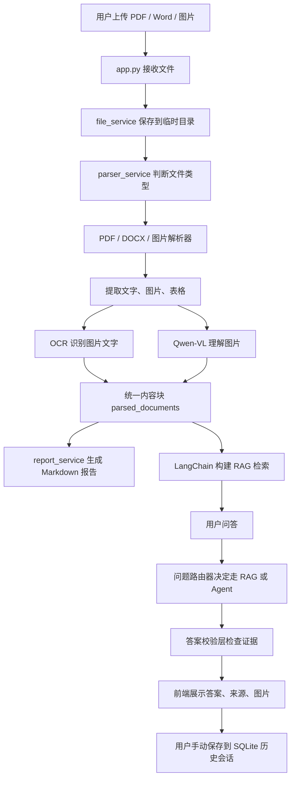
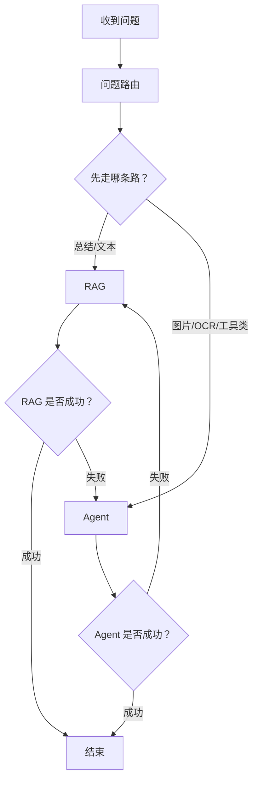
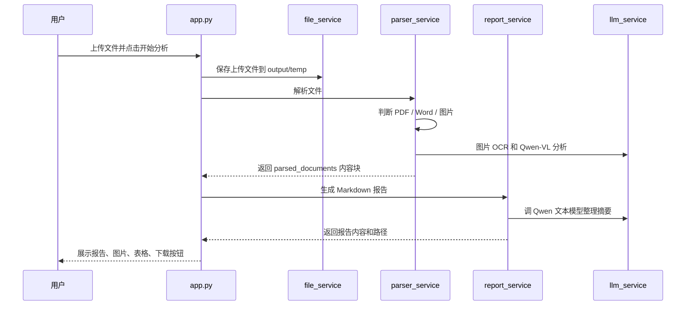
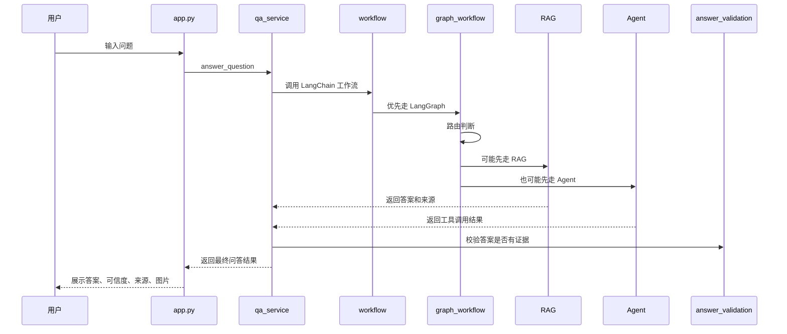

# 多模态图文智能分析助手：零基础展示讲解文档

> 这份文档假设读者完全不懂 Python，也不懂大模型、RAG、Agent、MCP。  
> 我们会用尽量朴素的语言，把这个项目讲成一个“会读文件、会看图片、会做笔记、会回答问题的智能秘书”。

---

## 1. 一句话讲清楚这个项目

这个系统做的事情很像一个认真负责的助理：

用户把 PDF、Word、图片交给它，它先把里面的文字、图片、表格都拆出来，然后让 OCR 和 Qwen 多模态模型帮忙“看图识字、理解图片”，再整理成一份 Markdown 总结报告。用户后面还可以像问老师一样提问，系统会从刚才解析出的内容里找证据，再组织答案，并把来源展示出来，尽量减少胡编乱造。

如果用生活比喻：

| 项目里的东西 | 像生活里的什么 | 它做什么 |
| --- | --- | --- |
| PDF / Word / 图片 | 一沓资料 | 用户交给系统看的原始材料 |
| 解析器 Parser | 拆快递的人 | 把资料拆成文字、图片、表格 |
| OCR | 放大镜 + 识字眼镜 | 从图片里认出文字 |
| Qwen-VL 多模态模型 | 会看图的老师 | 描述图片、图表、流程图 |
| RAG 检索问答 | 开卷考试 | 回答前先翻资料找证据 |
| Embedding | 把句子变成“意思坐标” | 方便系统按语义找相似内容 |
| FAISS | 快速找相似内容的地图 | 在大量内容里快速找相关片段 |
| BM25 | 关键词目录 | 按关键词匹配内容 |
| Agent | 会使用工具的小助理 | 自己决定该查文本、看图还是 OCR |
| LangGraph | 流程图红绿灯 | 控制先走 RAG 还是 Agent，失败后怎么补救 |
| MCP | 标准工具插座 | 让工具调用方式更统一、更像企业级系统 |
| SQLite | 小账本 | 保存手动存档的历史会话、报告和问答 |

---

## 2. 展示时可以这样开场

可以这样说：

> 我的项目是一个本地轻量 Web 应用，面向 PDF、Word、图片这类图文混合资料。它的目标不是简单读取文字，而是把文字、图片、表格统一转成结构化内容，再结合 Qwen 多模态模型、OCR、LangChain、RAG、Agent 和 MCP，完成文档总结与基于来源的问答。

更口语一点：

> 它就像一个会看文件的学习秘书。你把论文、说明书或者截图给它，它会先读字、看图、识别表格，然后写一份报告。你再问它问题，它不是凭空回答，而是先回到资料里找证据，再回答你，并告诉你答案来自哪里。

---

## 3. Python 基础小词典

不懂 Python 也没关系，先认识几个常见词。

| Python 词 | 奶奶版解释 | 小例子 |
| --- | --- | --- |
| `.py` 文件 | 一张菜谱纸 | 每个文件写着一部分做事步骤 |
| `import` | 借工具 | 从别的文件或库里拿现成能力 |
| `def` | 定义一个小工人 | 写一个函数，让它专门干一件事 |
| `class` | 做一类工具的模具 | 比如做一个“数据库仓库”对象 |
| `if / else` | 如果怎样，否则怎样 | 如果是 PDF 就用 PDF 解析器，否则换别的 |
| `list` | 清单 | 装很多内容块 |
| `dict` | 带标签的抽屉 | 用 `name`、`page`、`text` 这种标签存东西 |
| `return` | 把结果交回来 | 函数干完活，把结果还给调用者 |
| `try / except` | 试试看，坏了也别崩 | 调模型失败时，系统继续运行 |
| `Path` | 文件地址 | 告诉程序文件放在哪里 |

比如项目里经常出现这种结构：

```python
def parse_file(file_path):
    if file_path.endswith(".pdf"):
        return parse_pdf(file_path)
    else:
        return []
```

这段话翻译成人话就是：

> 定义一个叫 `parse_file` 的小工人。  
> 如果文件是 PDF，就交给 PDF 解析器。  
> 如果不是，就先返回一个空清单。

---

## 4. 整个系统像一条流水线

用户看到的是一个网页，但网页背后有很多小工人排队干活。



简单拆开讲：

1. 用户上传文件。
2. 系统先把文件放到临时目录。
3. 系统看文件后缀，判断是 PDF、Word 还是图片。
4. 对 PDF：提取正文、嵌入图片、页面截图、表格、图注区域。
5. 对 Word：提取段落和嵌入图片。
6. 对图片：读取尺寸、格式，做 OCR 和图像理解。
7. 所有结果统一变成“内容块”。
8. 内容块被送去生成总结报告。
9. 用户提问时，系统先检索相关内容，再交给模型回答。
10. 回答后，系统会展示来源，能展示文字，也能展示图片。
11. 用户点击“保存到历史会话”后，才会写入 SQLite 数据库。

---

## 5. 什么是“内容块”

这个项目最重要的中间结果叫内容块。可以把它理解成系统整理出来的小卡片。

一份 PDF 可能被拆成这些卡片：

| 内容块类型 | 里面有什么 | 举例 |
| --- | --- | --- |
| text | 普通文字 | 第 1 页摘要、第 2 页正文 |
| image | 图片说明 | 第 2 页图 1 的截图、OCR 文字、模型描述 |
| table | 表格内容 | 第 3 页表 1 的 Markdown 表格 |

为什么要拆成内容块？

因为大模型不适合直接吃一整个大文件。就像人读书也不会一口吞一本书，而是分章节、分段落、分图表来理解。

内容块大概长这样：

```python
{
    "type": "image",
    "source": "某论文.pdf 第 2 页 图注区域裁切 1",
    "page": 2,
    "image_path": "D:/AgentProject/output/images/xxx.png",
    "ocr_text": "图1 神经语言模型",
    "description": "这是一张神经网络语言模型结构图..."
}
```

这不是给用户看的最终内容，而是系统内部的小卡片。

---

## 6. 报告是怎么生成的

报告生成像写读书笔记。

系统先收集：

1. 文本内容。
2. 图片描述。
3. OCR 识别出的图片文字。
4. 表格内容。
5. 来源信息，比如第几页、第几张图。

然后交给 Qwen 文本模型整理成固定结构：

```markdown
# 文档总结报告
## 1. 核心摘要
## 2. 关键信息提取
## 3. 图表/图片说明
## 4. 表格内容摘要
## 5. 待确认或疑问点
```

为什么要固定结构？

因为展示和验收时需要稳定结果。固定结构就像写作文有标题、摘要、正文、结论，评委看起来更清楚，程序也更容易展示和下载。

现在报告里还会尽量嵌入：

1. 检测到的图片截图。
2. 表格预览图。
3. Markdown 表格文本。
4. 来源说明。

---

## 7. 问答是怎么实现的

问答可以理解成“开卷考试”。

用户问：

> 这篇文章的主旨是什么？

系统不会直接让大模型凭记忆乱答，而是先做三步：

1. 从文档内容块里找相关片段。
2. 把这些片段作为“证据”交给模型。
3. 让模型基于证据回答，并展示来源。

这个过程叫 RAG。

RAG 的全称是 Retrieval-Augmented Generation，中文可以叫“检索增强生成”。

奶奶版解释：

> 普通大模型像闭卷考试，可能会靠记忆瞎猜。  
> RAG 像开卷考试，先翻书找到相关页，再回答问题。

---

## 8. 为什么同时用 FAISS、Embedding 和 BM25

系统现在不是只靠简单关键词，而是用了两种找资料的方法。

| 方法 | 像什么 | 优点 | 缺点 |
| --- | --- | --- | --- |
| BM25 | 书后面的关键词索引 | 对明确关键词很敏感 | 换个说法可能找不到 |
| Embedding + FAISS | 按意思找相近内容 | 能理解语义相近 | 依赖向量模型质量 |

举个例子：

用户问：

> Word2vec 有哪几种训练方式？

文档里可能写：

> CBOW 和 Skip-gram 是 Word2vec 的两种核心模型。

BM25 会看关键词是否重合。  
Embedding 会看“训练方式”和“核心模型”意思是否接近。

所以两者结合更稳。

---

## 9. Agent 是什么

Agent 可以理解成“会自己决定用什么工具的小助理”。

普通 RAG 是：

> 用户问问题 -> 系统检索文本 -> 模型回答。

Agent 更像：

> 用户问问题 -> 小助理判断要不要查文本、看图片、做 OCR、读报告摘要 -> 调用工具 -> 综合回答。

本项目里 Agent 可以使用这些工具：

| 工具 | 作用 |
| --- | --- |
| `search_document_blocks` | 搜索文档内容块 |
| `run_image_ocr` | 对图片做 OCR |
| `analyze_image` | 调 Qwen-VL 分析图片 |
| `get_report_summary` | 获取报告摘要 |

如果 Agent 调用失败，系统不会直接崩溃，而是回退到 RAG。

为什么这样设计？

因为展示时稳定性非常重要。真正的工程系统不能因为一个模型接口偶尔抽风就整套系统罢工。

---

## 10. LangGraph 是什么

LangGraph 可以理解成“流程图红绿灯”。

它不是一个新模型，而是控制流程的框架。

比如问答时，它可以规定：

1. 先判断问题类型。
2. 如果是总结类问题，优先走 RAG。
3. 如果是图片、OCR、图表类问题，优先走 Agent。
4. 如果 Agent 失败，回退到 RAG。
5. 如果 RAG 不够，再尝试 Agent。

这比一堆 `if else` 更清楚，因为它像画流程图一样管理状态。

---

## 11. MCP 是什么

MCP 可以理解成“标准插座”。

以前工具调用可能是：

> 这个工具这样传参数，那个工具那样传参数，返回格式也不一样。

MCP 化以后，工具返回统一格式：

```python
{
    "ok": True,
    "data": {...},
    "error": None,
    "metadata": {...}
}
```

这样 Agent 不用猜工具有没有成功，也不用猜结果放在哪里。

奶奶版解释：

> MCP 就像家里的标准插座。  
> 不管插的是台灯、电饭煲还是手机充电器，都按统一接口来。  
> 系统以后扩展新工具也更容易。

---

## 12. SQLite 数据库保存什么

SQLite 是一个很轻的小数据库，可以理解成项目自己的“小账本”。

当前数据库文件位置：

```text
D:/AgentProject/output/system_state.db
```

它保存：

1. 历史会话。
2. 上传过的文件记录。
3. 解析出的内容块。
4. 生成的报告。
5. 问答记录。
6. Agent 运行记录。

注意：现在系统不是自动保存历史会话，而是需要用户手动点击保存。

为什么要手动保存？

因为用户可能只是随便测试一个文件，不一定想污染历史记录。手动保存更干净，也更像正式产品里的“确认归档”。

---

## 13. 项目目录整体结构

项目可以看成一栋小楼：

```text
D:/AgentProject
├─ app.py                         # 前台接待员，Streamlit 网页入口
├─ requirements.txt               # 依赖清单，告诉电脑要安装哪些库
├─ README.md                      # 项目说明书
├─ .env                           # API Key 和模型配置
├─ parsers/                       # 文件解析工人
├─ services/                      # 核心业务服务
├─ langchain_app/                 # LangChain、RAG、Agent、LangGraph
├─ mcp_server/                    # MCP 工具服务
├─ storage/                       # SQLite 数据库存取
├─ prompts/                       # 提示词模板
├─ output/                        # 输出报告、图片、数据库
└─ tests/                         # 自动测试
```

每个文件夹的职责：

| 文件夹 | 像什么 | 负责什么 |
| --- | --- | --- |
| `parsers` | 拆快递车间 | 从 PDF、Word、图片里拆出内容 |
| `services` | 办公室各部门 | 报告、问答、OCR、模型、状态管理 |
| `langchain_app` | 智能问答大脑 | RAG、Agent、工具、LangGraph |
| `mcp_server` | 标准工具服务台 | 把工具封成统一接口 |
| `storage` | 档案室 | 保存历史会话和数据库记录 |
| `tests` | 质检员 | 检查各模块是否能正常工作 |

---

## 14. 每个 Python 文件是干什么的

下面按文件夹逐个说明。

### 14.1 根目录

| 文件 | 奶奶版作用 | 为什么这样写 |
| --- | --- | --- |
| `app.py` | 网页前台。用户上传文件、点击分析、看报告、提问题，都从这里开始。 | Streamlit 写网页很快，适合项目展示；前端逻辑集中在这里，方便演示。 |

`app.py` 主要做这些事：

1. 配置运行日志，减少 PDF 解析时刷屏警告。
2. 初始化网页状态，比如当前报告、当前会话、是否已保存。
3. 接收用户上传的文件。
4. 调用解析服务，把文件转成内容块。
5. 调用报告服务，生成 Markdown 报告。
6. 调用问答服务，生成回答和来源。
7. 点击保存后，把当前会话写入 SQLite。
8. 展示本地图片，解决 Markdown 本地图片不显示的问题。

为什么 `app.py` 不直接做所有事情？

因为如果所有代码都堆在 `app.py`，它会变成一锅粥。现在把解析、报告、问答、数据库拆出去，`app.py` 只负责“指挥”和“展示”。

---

### 14.2 `parsers` 文件夹：文件解析工人

| 文件 | 奶奶版作用 | 为什么这样写 |
| --- | --- | --- |
| `parsers/__init__.py` | 告诉 Python：这个文件夹是一个包。 | 有了它，别的代码才能方便地导入解析器。 |
| `parsers/pdf_parser.py` | PDF 专用拆解工。提取文字、图片、表格、页面截图和图注区域。 | PDF 很复杂，单独写一个文件，方便处理扫描件、论文图表、表格等细节。 |
| `parsers/docx_parser.py` | Word 专用拆解工。提取段落和嵌入图片。 | Word 的结构和 PDF 不一样，所以分开解析。 |
| `parsers/image_parser.py` | 图片专用拆解工。读取图片尺寸，做 OCR，调用 Qwen-VL 描述图片。 | 单张图片没有正文结构，所以需要直接走图像理解链路。 |

重点讲 `pdf_parser.py`：

PDF 解析最难，因为 PDF 有时像“电子书”，有时像“一张扫描照片”。

它做了几件事：

1. 用 `pypdf` 尝试提取文字。
2. 用 `pdfplumber` 尝试提取表格。
3. 用 `PyMuPDF` 把页面或图注附近区域截图。
4. 检测类似“图1”“Figure 1”的图注。
5. 过滤太小、太空白、没意义的图片。
6. 对图片做 OCR 和 Qwen-VL 视觉分析。

为什么要做图注区域裁切？

因为有些论文里的图不是普通嵌入图片，PDF 工具直接抽不出来。  
这时系统会根据“图1 神经语言模型”这种图注，在附近截一块图，这样能把图表救回来。

---

### 14.3 `services` 文件夹：业务服务层

| 文件 | 奶奶版作用 | 为什么这样写 |
| --- | --- | --- |
| `services/__init__.py` | 标记服务文件夹是 Python 包。 | 方便导入。 |
| `services/file_service.py` | 文件管家。负责保存上传文件、创建和清理目录。 | 文件操作集中管理，避免到处乱写路径。 |
| `services/parser_service.py` | 总调度。看文件类型，再分配给 PDF、Word 或图片解析器。 | 把“判断文件类型”的逻辑单独放一处，后续扩展 Excel、PPT 更方便。 |
| `services/ocr_service.py` | OCR 服务。尝试用本地 OCR 识别图片文字。 | 图片里的文字不能靠普通文本提取，需要 OCR。 |
| `services/llm_service.py` | 大模型服务。负责调用 Qwen 文本模型和 Qwen-VL 视觉模型。 | 所有模型 API 调用集中管理，方便换模型或处理失败。 |
| `services/report_service.py` | 报告写手。把内容块整理成 Markdown 报告，插入图片和表格预览。 | 报告格式固定，单独维护更清楚。 |
| `services/qa_service.py` | 问答总管。接收用户问题，调用 LangChain 工作流，格式化答案和来源。 | 前端不用关心 RAG、Agent、校验细节。 |
| `services/retrieval_service.py` | 旧版/轻量检索服务。提供基础检索能力。 | 保留兜底能力，防止 LangChain 依赖不可用时完全不能问答。 |
| `services/state_service.py` | 状态管理服务。负责保存和读取历史会话。 | 前端不直接碰数据库，降低耦合。 |
| `services/answer_validation_service.py` | 答案校验员。检查回答有没有证据支撑、可信度如何。 | 减少幻觉，让展示时更有说服力。 |
| `services/text_quality_service.py` | 文本清洗工。处理 PDF 提取出的乱码、重复字符、低质量文本。 | 很多 PDF 文本会出现 `/G1/G1` 或重复数字，需要清理。 |
| `services/logging_service.py` | 静音器。压住 PDF 解析库的大量无用警告。 | 让 Streamlit 控制台更干净，不影响演示观感。 |

重点讲 `llm_service.py`：

它就像项目的“外脑接口”。  
如果配置了 Qwen API Key，它会调用真实模型。  
如果没配置或调用失败，它会返回基础兜底结果，保证系统不至于马上崩。

为什么要有兜底？

展示时网络、大模型排队、Key 配置都可能出问题。兜底可以让系统至少继续跑完整流程。

重点讲 `report_service.py`：

它负责把杂乱的内容块整理成好看的报告。  
它还处理本地图片和表格预览，因为纯 Markdown 有时候不能直接显示本地图片，所以前端和报告服务要配合处理。

重点讲 `qa_service.py`：

它不是自己回答问题，而是像值班经理：

1. 收到问题。
2. 调用 LangChain 工作流。
3. 拿到回答、来源、工具调用记录。
4. 调用答案校验层。
5. 把结果整理成前端能展示的结构。

---

### 14.4 `langchain_app` 文件夹：RAG、Agent 和 LangGraph 大脑

| 文件 | 奶奶版作用 | 为什么这样写 |
| --- | --- | --- |
| `langchain_app/__init__.py` | 标记这是 LangChain 模块。 | 方便导入。 |
| `langchain_app/models.py` | 模型工厂。创建 Qwen 聊天模型实例。 | 模型配置集中管理，换模型更方便。 |
| `langchain_app/embeddings.py` | 向量模型工厂。把文字变成语义向量。 | RAG 需要 embedding 才能按意思检索。 |
| `langchain_app/document_builder.py` | 文档转换器。把项目内容块变成 LangChain Document。 | LangChain 有自己的标准文档格式，需要转换。 |
| `langchain_app/vectorstore.py` | FAISS 建库工。用向量创建可检索的知识库。 | FAISS 负责快速语义检索。 |
| `langchain_app/retrievers.py` | 检索器组合员。组合 FAISS 和 BM25。 | 语义检索 + 关键词检索一起用更稳。 |
| `langchain_app/prompts.py` | 提示词仓库。定义问答时怎么要求模型回答。 | 提示词集中管理，避免散落各处。 |
| `langchain_app/chains.py` | RAG 链条。把检索、提示词、模型回答串起来。 | LangChain 擅长把多个步骤串成链。 |
| `langchain_app/router.py` | 问题路由器。判断问题更适合 RAG 还是 Agent。 | 不同问题走不同路线，效率和准确性更好。 |
| `langchain_app/tools.py` | 工具包装器。把 OCR、图片分析、文本检索封成 Agent 工具。 | Agent 需要标准工具才能调用。 |
| `langchain_app/agent.py` | Agent 执行器。让模型决定调用哪些工具；失败时走确定性工具计划。 | 体现 Agent 能力，同时保证稳定性。 |
| `langchain_app/graph_workflow.py` | LangGraph 流程图。规定路由、RAG、Agent、失败回退的流程。 | 比普通代码更像企业级可观测工作流。 |
| `langchain_app/workflow.py` | 问答总工作流入口。优先走 LangGraph，不行就走普通函数流程。 | 让上层服务不用关心底层实现。 |
| `langchain_app/mcp_client.py` | MCP 客户端。通过标准协议调用 MCP 工具服务。 | 让工具调用更标准化，更接近企业 Agent 架构。 |

重点讲 `document_builder.py`：

项目自己有内容块，但 LangChain 不认识。  
LangChain 认识的是 `Document`。

所以它做翻译：

```text
项目内容块 -> LangChain Document
```

每个 `Document` 会带上：

1. 正文内容。
2. 文件名。
3. 页码。
4. 类型，是文本、图片还是表格。
5. 图片路径。
6. 来源说明。

这样问答时才能展示“答案来自第几页、哪张图”。

重点讲 `retrievers.py`：

它把两个检索器绑在一起：

1. BM25：按关键词找。
2. FAISS：按语义找。

为什么不只用一个？

因为用户问法可能和原文不完全一样。  
关键词能抓精确词，向量能抓相近意思，两者互补。

重点讲 `agent.py`：

Agent 原本依赖大模型的工具调用能力，但大模型不一定每次都稳定。  
所以这里做了双保险：

1. 优先尝试真正的 LangChain Agent。
2. 如果失败，就走确定性工具计划。

确定性工具计划是什么意思？

就是代码自己判断：

1. 如果用户问总结，就读报告摘要。
2. 如果用户问图片，就查图片块，必要时分析图片。
3. 如果用户问普通内容，就检索文本块。

这样既能体现 Agent，又不至于演示时频繁回退。

重点讲 `graph_workflow.py`：

它把问答流程画成图：



---

### 14.5 `mcp_server` 文件夹：标准工具服务台

| 文件 | 奶奶版作用 | 为什么这样写 |
| --- | --- | --- |
| `mcp_server/__init__.py` | 标记 MCP 文件夹是 Python 包。 | 方便导入。 |
| `mcp_server/main.py` | MCP 服务启动入口。 | 客户端可以通过它启动工具服务。 |
| `mcp_server/server.py` | MCP 服务核心。注册工具和资源。 | 把工具、资源统一暴露出去。 |
| `mcp_server/tools.py` | MCP 工具实现。搜索内容块、OCR、图片分析、报告摘要。 | 工具逻辑集中管理，返回格式统一。 |
| `mcp_server/resources.py` | MCP 资源定义。提供会话、报告、文档、问答历史资源。 | Agent 不只调用工具，也可以读取标准资源。 |
| `mcp_server/adapters.py` | 适配器。把项目内部数据转成 MCP 需要的形式。 | 内部结构和外部标准协议之间需要翻译层。 |

为什么要有 MCP？

因为如果以后接入更多 Agent 平台，或者把 OCR、图片分析、检索服务拆出去，MCP 能让这些能力像标准接口一样被调用。

---

### 14.6 `storage` 文件夹：数据库档案室

| 文件 | 奶奶版作用 | 为什么这样写 |
| --- | --- | --- |
| `storage/__init__.py` | 标记数据库文件夹是 Python 包。 | 方便导入。 |
| `storage/db.py` | 建数据库表。定义 SQLite 里有哪些表。 | 数据库结构集中管理。 |
| `storage/repositories.py` | 数据库仓库。负责保存、查询、读取会话和记录。 | 避免业务代码直接写 SQL，结构更清楚。 |

`db.py` 像设计账本格式。  
`repositories.py` 像真正负责往账本里写字、查字的人。

它们大概保存这些表：

| 表 | 保存什么 |
| --- | --- |
| `analysis_session` | 一次分析会话 |
| `document_record` | 上传文件记录 |
| `document_block` | 文本、图片、表格内容块 |
| `report_record` | 生成的报告 |
| `qa_record` | 问答记录 |
| `agent_run` | Agent 执行记录 |

---

### 14.7 `tests` 文件夹：自动质检员

测试文件不是给用户直接使用的，而是给开发者检查系统有没有坏。

| 文件 | 检查什么 |
| --- | --- |
| `tests/test_agent_tool_plan.py` | 检查 Agent 的兜底工具计划是否正常。 |
| `tests/test_answer_validation_service.py` | 检查答案校验层是否能判断可信度和证据。 |
| `tests/test_langchain_document_builder.py` | 检查内容块能否转成 LangChain Document。 |
| `tests/test_langchain_retriever_fallback.py` | 检查检索器依赖缺失时是否能兜底。 |
| `tests/test_langchain_router.py` | 检查问题路由器能否判断问题类型。 |
| `tests/test_langchain_tools.py` | 检查 LangChain 工具封装是否可用。 |
| `tests/test_langchain_workflow.py` | 检查问答工作流是否正常。 |
| `tests/test_llm_service.py` | 检查大模型服务的调用和兜底逻辑。 |
| `tests/test_mcp_client.py` | 检查 MCP 客户端。 |
| `tests/test_mcp_server.py` | 检查 MCP 服务端工具和资源。 |
| `tests/test_parser_service.py` | 检查文件解析调度。 |
| `tests/test_pdf_parser_helpers.py` | 检查 PDF 图像、图注、裁切辅助函数。 |
| `tests/test_qa_output_sources.py` | 检查问答输出是否带来源。 |
| `tests/test_qa_service.py` | 检查问答服务整体逻辑。 |
| `tests/test_qa_source_formatting.py` | 检查来源格式化，尤其是图片来源。 |
| `tests/test_qa_validation_output.py` | 检查问答结果里是否包含答案校验。 |
| `tests/test_report_service.py` | 检查报告生成、图片和表格展示。 |
| `tests/test_retrieval_service.py` | 检查基础检索服务。 |
| `tests/test_state_service.py` | 检查历史会话保存和读取。 |
| `tests/test_text_quality_service.py` | 检查 PDF 噪声文本清洗。 |

为什么要写测试？

因为项目模块越来越多，修一个地方可能不小心弄坏另一个地方。  
测试就像体检表，每次改完代码跑一遍，可以更快发现问题。

---

## 15. 用户点击“开始分析”时，代码怎么走

这个是展示时最重要的主流程。



奶奶版解释：

1. `app.py` 是前台，收下文件。
2. `file_service.py` 把文件放好。
3. `parser_service.py` 判断该叫哪个解析器。
4. `pdf_parser.py`、`docx_parser.py`、`image_parser.py` 开始拆文件。
5. `ocr_service.py` 负责看图片里的字。
6. `llm_service.py` 负责请 Qwen 看图和写摘要。
7. `report_service.py` 把所有结果整理成报告。
8. `app.py` 把报告展示给用户。

---

## 16. 用户提问时，代码怎么走



奶奶版解释：

用户问问题后，系统不是直接回答，而是先找路：

1. 这个问题是不是总结类？
2. 是不是问图片？
3. 是不是问 OCR？
4. 是不是需要工具？

然后系统决定：

1. 走 RAG：像开卷考试，先查资料。
2. 走 Agent：像让小助理自己选工具。

最后答案校验层会检查：

1. 有没有来源？
2. 来源够不够？
3. 答案和来源关键词是否匹配？
4. 可信度是高、中还是低？

---

## 17. 为什么代码要拆这么多文件

因为这是工程项目，不是一次性脚本。

如果所有代码都写在一个文件里，会出现这些问题：

1. 想找某个功能很难。
2. 改 PDF 解析时容易弄坏问答。
3. 测试不方便。
4. 后面接入新模型、新工具很麻烦。
5. 展示时讲不清楚架构。

现在拆分后，每个模块像一个岗位：

| 岗位 | 对应代码 |
| --- | --- |
| 前台 | `app.py` |
| 文件保管员 | `file_service.py` |
| 拆文件工人 | `parsers/` |
| 模型联络员 | `llm_service.py` |
| 报告撰写员 | `report_service.py` |
| 问答经理 | `qa_service.py` |
| 检索专家 | `langchain_app/retrievers.py` |
| 工具助理 | `langchain_app/agent.py` |
| 流程调度员 | `langchain_app/graph_workflow.py` |
| 标准工具台 | `mcp_server/` |
| 档案管理员 | `storage/` |

---

## 18. 为什么要用 Qwen 系列模型

项目使用 Qwen 系列，主要因为：

1. Qwen 文本模型适合中文总结和问答。
2. Qwen-VL 可以理解图片、图表、截图。
3. DashScope 提供云端 API，不需要本地跑大模型。
4. 本地机器压力小，适合轻量 Web 应用。
5. 后续也可以替换成其他兼容 OpenAI SDK 的模型。

`.env` 里一般会配置：

```text
DASHSCOPE_API_KEY=你的API密钥
DASHSCOPE_BASE_URL=https://dashscope.aliyuncs.com/compatible-mode/v1
QWEN_TEXT_MODEL=qwen-plus
QWEN_VISION_MODEL=qwen-vl-plus
QWEN_EMBEDDING_MODEL=text-embedding-v4
```

可以这样讲：

> 本项目没有在本地训练大模型，而是采用云端 Qwen API。这样本地只负责文件解析、状态管理、检索和前端展示，把重计算交给云端模型完成。

---

## 19. 为什么不建议现在做模型微调

如果展示被问到“为什么不微调模型”，可以这样答：

> 当前项目主要问题不是模型不会说话，而是文档解析、图文对齐、检索证据、工具调用和状态管理。微调更适合有大量稳定标注数据、明确垂直任务和评测集的场景。这个项目现阶段更适合优先优化 RAG、提示词、表格识别、图像裁切和 Agent 工具稳定性。

奶奶版解释：

> 现在不是要重新训练一个厨师，而是要先把菜洗干净、切好、分类放好。  
> 如果原材料都没整理好，训练厨师也很难做出好菜。

---

## 20. 系统目前已经体现哪些技术点

| 技术点 | 是否体现 | 项目里怎么体现 |
| --- | --- | --- |
| MLLM 多模态模型 | 已体现 | Qwen-VL 分析图片、图表、页面截图 |
| OCR | 已体现 | 图片文字识别，和视觉描述一起进入内容块 |
| LangChain | 已体现 | Document、Retriever、Chain、Tool、Agent |
| RAG | 已体现 | FAISS + Embedding + BM25 检索后回答 |
| Agent | 已体现 | 工具封装、问题路由、Agent 调工具、兜底计划 |
| LangGraph | 已体现 | 问答流程图控制 RAG / Agent / fallback |
| MCP | 已体现 | 工具和资源统一封装为 MCP 风格接口 |
| SQLite 状态管理 | 已体现 | 手动保存历史会话、报告、问答记录 |
| 答案校验 | 已体现 | 输出可信度、证据支撑和风险说明 |

---

## 21. 可能被问到的问题和简单回答

### Q1：这个项目和普通 OCR 有什么区别？

普通 OCR 主要是“认字”。  
这个项目不只认字，还会理解图片内容、提取表格、生成总结报告，并支持基于文档内容问答。

### Q2：为什么要用 RAG？

因为直接问大模型容易幻觉。RAG 会先从上传文档里找证据，再让模型回答，更适合文档问答。

### Q3：为什么还要 Agent？

RAG 擅长查文本，但用户可能问图片、OCR、报告摘要。Agent 可以根据问题选择不同工具，更灵活。

### Q4：LangChain 在项目里具体做了什么？

LangChain 负责把内容块转成标准 Document，构建检索器，组织 RAG 问答链，并封装 Agent 工具。

### Q5：LangGraph 在项目里有什么用？

LangGraph 负责控制问答流程，决定先走 RAG 还是 Agent，并处理失败回退，让流程更清楚、更稳定。

### Q6：MCP 在项目里有什么用？

MCP 把文本检索、OCR、图片分析、报告摘要变成标准工具接口。以后如果接更多工具或平台，会更容易扩展。

### Q7：为什么不用数据库自动保存？

为了避免用户随手测试的文件污染历史记录。当前设计是用户确认后手动保存，更符合可控的状态管理。

### Q8：图片为什么要裁切图注区域？

很多论文 PDF 的图片不一定能被直接抽出来。系统根据“图1”“Figure 1”这类图注裁切附近区域，可以提高论文图表识别率。

### Q9：如果模型 API 调用失败怎么办？

系统有兜底机制。图像分析失败会标注无法识别，Agent 失败会回退到 RAG，部分模型失败也会返回基础结果，保证流程尽量不中断。

### Q10：这个项目距离企业级 Agent 还差什么？

还可以继续加强权限控制、任务队列、异步处理、日志监控、评测体系、多用户隔离、安全审计、成本统计和更标准的 MCP 服务部署。

---

## 22. 展示时推荐演示路线

建议按这个顺序演示：

1. 打开 Streamlit 页面。
2. 上传一份包含文字、图片、表格的 PDF。
3. 点击开始分析。
4. 展示生成的 Markdown 总结报告。
5. 指出报告里的图片说明、表格预览和来源。
6. 提问：“这篇文章的主旨是什么？”
7. 展示回答、答案校验和来源。
8. 提问：“图1讲的是什么？”
9. 展示图片来源和图像描述。
10. 点击保存到历史会话。
11. 在侧边栏加载历史会话，说明 SQLite 持久化。
12. 最后讲技术栈：Qwen + OCR + LangChain + RAG + Agent + LangGraph + MCP + SQLite。

---

## 23. 可以背下来的项目总结

可以用这一段作为展示结尾：

> 本项目实现了一个面向图文混合文档的智能分析助手。系统支持 PDF、Word 和图片上传，通过解析器提取文本、图片和表格，通过 OCR 和 Qwen-VL 完成图片文字识别与图像理解，再统一构建内容块。报告生成模块会输出结构化 Markdown 总结，问答模块基于 LangChain 构建 RAG 检索链，并结合 FAISS、Embedding 和 BM25 提升召回效果。同时，系统引入 Agent 工具调用、LangGraph 流程编排、MCP 标准化工具接口和 SQLite 轻量状态管理，能够展示较完整的大模型应用工程链路。

更口语一点：

> 这个系统不是简单调用一次大模型，而是做了一整套文档理解流水线：先拆文件，再看图识字，再整理报告，再带证据回答问题。它把多模态模型、RAG、Agent、LangGraph、MCP 和状态管理串在了一起，是一个比较完整的本地轻量智能文档分析应用。

---

## 24. 最后给自己的理解口诀

如果临场紧张，就记住这几句：

```text
上传文件，先保存。
判断类型，分开拆。
文字直接读，图片先 OCR 再找 Qwen 看。
所有结果变成内容块。
报告模块写总结。
问答模块先检索，再回答。
Agent 会选工具。
LangGraph 管流程。
MCP 管接口。
SQLite 管历史。
来源展示防幻觉。
```

这就是整个项目的骨架。

